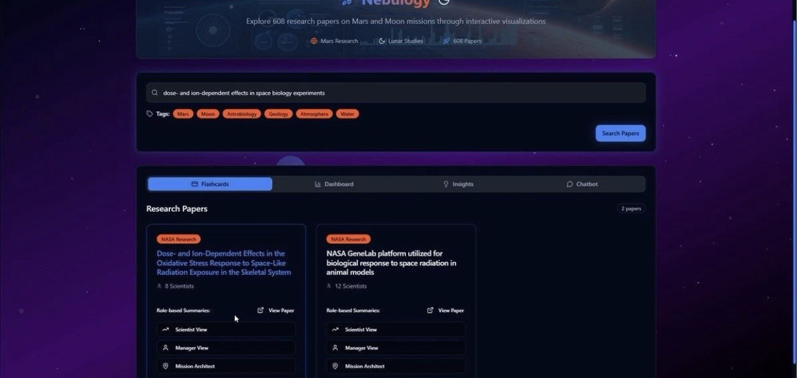
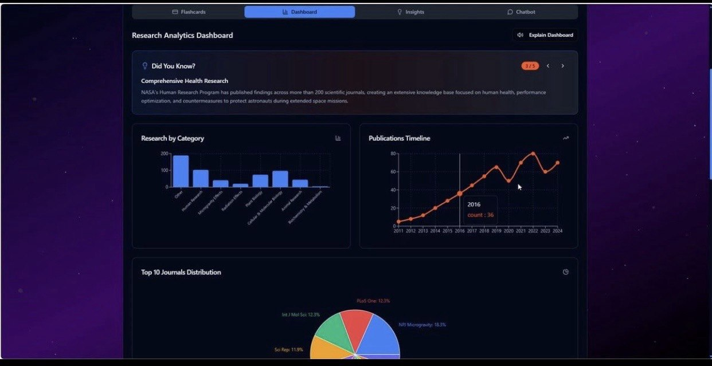
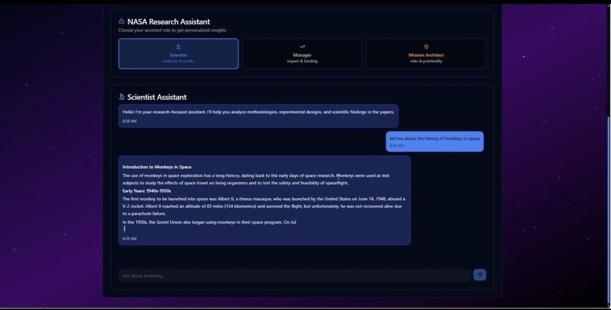

# Nebulogy – Space Biology Knowledge Engine

## Overview
Nebulogy is an AI-powered web application that transforms 608 NASA bioscience publications into actionable insights. It allows researchers, managers, and mission architects to efficiently explore role-specific summaries, knowledge graphs, and interactive dashboards.  

Developed during **NASA Space Apps Cairo Hackathon 2025** at Zewail City of Science and Technology.  

---

## How It Works
1. **Search & Flashcards:** Users can search topics or publications and refine results with tags (Mars, Moon, water, geology, etc.). Semantic search retrieves the most relevant publications as flashcards with summaries by role:
   - **Scientist:** methods, results, hypotheses
   - **Manager:** broader impacts, investment potential
   - **Mission Architect:** risks, requirements, insights
     
   Each flashcard links to the original NASA page.

2. **Review Insights:** Users can explore synthesized insights from hundreds of publications, from research recommendations to knowledge gaps, conflicts, and suggested future missions.

3. **Interactive Dashboards:** Navigate dashboards featuring knowledge graphs and analytical charts displaying key metrics and progress across the 608 studies. Audio guidance explains charts and graphs for an engaging user experience. Users can also explore NASA resources like OSDR, NSLSL, and NASA Task Book, and view key experiments.

4. **Chatbot:** Users can ask questions through a role-adapted Chatbot that provides tailored explanations and insights for scientists, managers, and mission architects.

---

## Tech Stack
- **Frontend:** React.js
- **Backend:** FastAPI
- **Scraping:** Beautiful Soup
- **Embeddings & Semantic Search:** Sentence Transformers + Milvus
- **Summarization:** LangGraph
- **LLM Calls:** Groq API

---

## Screenshots from the Application

### Flashcards


### Manager Summary


### Mission Architect Summary


### Analytics


### Knowledge Graph


### Future Mission Suggestions


### Future Mission Card


### Chatbot


### NASA Resources


---

## Installation

### Backend
```bash
cd backend
pip install -r requirements.txt
uvicorn main:app --reload
```

### Frontend
```bash
cd frontend
npm install   # first time only
npm run dev
```


---

## Application
- **Web App:** [Nebulogy](https://lnkd.in/dXSMpktn)


---

## Tech Stack Table
| Component      | Technology |
|----------------|------------|
| Frontend       | React.js   |
| Backend        | FastAPI    |
| Scraping       | Beautiful Soup |
| Embeddings & Search | Sentence Transformers + Milvus |
| Summarization  | LangGraph  |
| LLM Calls      | Groq API   |


---

## 👤 Author

**Ahmed Mohamed**  
📧 [ahmed.mohamed04@hotmail.com](mailto:ahmed.mohamed04@hotmail.com)  
🔗 [LinkedIn Profile](https://www.linkedin.com/in/ahmed04/)

